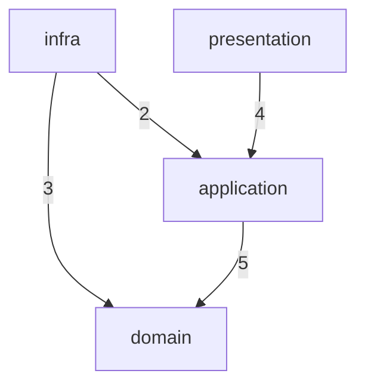

# Lodestar

**Declare your architecture. Enforce it.**

Lodestar enforces intra-package architecture rules that ESLint can't — layer dependencies, module boundaries, circular imports. Define your architecture in `lodestar.config.ts`, enforce it in CI, visualize it as a diagram.

```ts
// lodestar.config.ts
import { defineConfig } from 'lodestar';
import { pluginArchitecture } from '@lodestar/plugin-architecture';

export default defineConfig({
  plugins: [pluginArchitecture],
  rules: {
    'architecture/layers': {
      severity: 'error',
      options: {
        layers: [
          { name: 'domain', path: 'src/domain/**' },
          { name: 'application', path: 'src/application/**', canImport: ['domain'] },
          { name: 'infra', path: 'src/infra/**', canImport: ['domain', 'application'] },
          { name: 'presentation', path: 'src/presentation/**', canImport: ['application'] },
        ],
      },
    },
    'architecture/modules': {
      severity: 'error',
      options: { modules: ['src/domain', 'src/billing', 'src/auth'] },
    },
    'architecture/no-circular': 'error',
  },
});
```

```sh
npx lodestar check              # Enforce
npx lodestar graph --layers     # Visualize
npx lodestar impact src/file.ts # Analyze
```

## Why?

Every project has unwritten rules:

- "The domain layer should never import from infrastructure"
- "Import billing through its barrel, not its internals"
- "No circular dependencies between modules"

These rules live in people's heads. They erode silently. By the time someone notices, the codebase has drifted.

Lodestar makes these rules explicit — written in your repo, versioned in git, enforced in CI.

## What Lodestar Does

### Enforce — `lodestar check`

```
@lodestar/core
  ✓ architecture/layers                    12 files, 3 layers   5ms
  ✓ architecture/modules                   12 files             3ms
  ✓ architecture/no-circular               24 modules           2ms
  3 rules passed, 0 errors, 0 warnings (10ms)
```

### Visualize — `lodestar graph --layers`



Shows your declared architecture with actual dependency counts. Violations appear as dashed red lines.

### Analyze — `lodestar impact src/domain/entity.ts`

```
Impact analysis for src/domain/entity.ts

Direct dependents (3):
  src/application/user-service.ts
  src/infra/user-repository.ts
  src/domain/index.ts

Transitive dependents (2):
  src/presentation/user-controller.ts (via src/application/user-service.ts)
  src/infra/index.ts (via src/infra/user-repository.ts)

Total: 5 files affected
```

## Getting Started

```sh
npm install -D lodestar @lodestar/plugin-architecture
npx lodestar init
npx lodestar check
```

## Rules

### `architecture/layers` — Dependency Direction

The centerpiece. Declare your layers and what each can import:

```ts
layers: [
  { name: 'domain', path: 'src/domain/**' },
  { name: 'application', path: 'src/application/**', canImport: ['domain'] },
  { name: 'infra', path: 'src/infra/**', canImport: ['domain', 'application'] },
];
```

Anything not in `canImport` is forbidden. New layers are blocked by default. Same-layer imports are always allowed.

Works for any architecture pattern — Clean Architecture, Hexagonal, Feature Slices:

```ts
// Feature isolation
layers: [
  { name: 'shared', path: 'src/shared/**' },
  { name: 'billing', path: 'src/features/billing/**', canImport: ['shared'] },
  { name: 'auth', path: 'src/features/auth/**', canImport: ['shared'] },
];
```

### `architecture/modules` — Module Encapsulation

Declare directories as modules. External code must use the barrel:

```ts
modules: ['src/billing', 'src/auth'];
```

`src/app.ts` importing `src/billing/internal/calc.ts` → error. Must use `src/billing/index.ts`.

### `architecture/no-circular` — Circular Dependencies

Detects circular dependency chains with configurable scope and depth limits.

### `architecture/no-circular-packages` — Package Cycles

Detects circular dependencies between workspace packages by analyzing package.json.

## ESLint Integration

Centralize ESLint rules in `lodestar.config.ts` alongside architecture rules:

```ts
import { eslintAdapter } from '@lodestar/adapter-eslint';

export default defineConfig({
  plugins: [pluginArchitecture],
  rules: { ... },
  adapters: [
    eslintAdapter({
      presets: ['strict'],
      rules: { '@typescript-eslint/consistent-type-imports': 'error' },
    }),
  ],
});
```

```js
// eslint.config.js — one line
import { fromLodestar } from '@lodestar/adapter-eslint';
export default await fromLodestar();
```

## Writing Custom Rules

```ts
import { definePlugin, defineRule } from 'lodestar';

const noUtilsBarrel = defineRule({
  name: 'my-team/no-utils-barrel',
  needs: ['fs'],
  async check(ctx) {
    if (await ctx.providers.fs.exists('src/utils/index.ts')) {
      ctx.report({ message: 'Colocate utilities with consumers' });
    }
  },
});

export const myPlugin = definePlugin(() => ({
  name: 'my-team',
  rules: [noUtilsBarrel],
}));
```

## Monorepo Support

Auto-detects `pnpm-workspace.yaml`. Root config applies globally, per-package configs override:

```sh
lodestar check              # workspace mode (auto)
lodestar check --workspace  # explicit
```

## License

MIT
